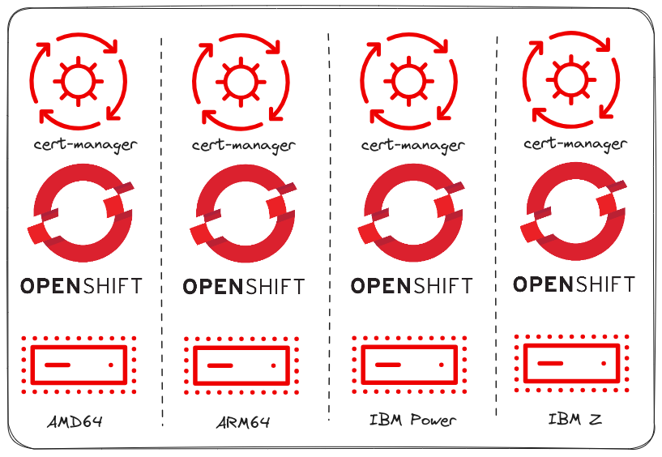
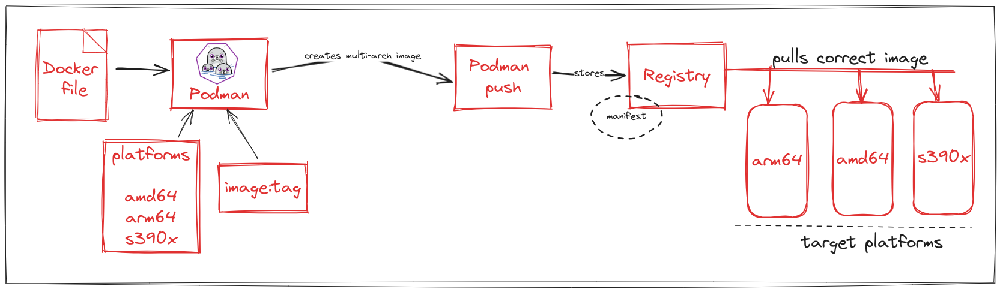

[toc]

# Manage certificates on OpenShift running on IBM Z®, IBM Power® and ARM64 architectures.


## Intoduction

Kubernetes thrives on secure communication, but manually managing SSL/TLS certificates is a tangled mess and error-prone process, leading to outages, security vulnerabilities, and operational overhead.


The [cert-manager](https://docs.openshift.com/container-platform/4.14/security/cert_manager_operator/index.html) Operator for Red Hat OpenShift provides a secure and efficient solution for TLS certificate management in OpenShift Container Platform clusters, by introducing certificates and certificate issuers as primary resources in the Kubernetes API.  This _**'certificates as a service'**_ model seamlessly integrates with external certificate authorities, automating the entire certificate lifecycle, from provisioning to renewal, ensuring validity and timely updates.

Now, with the latest update, the cert-manager Operator for Red Hat OpenShift `v1.13.0` has undergone an expansion in its scope. Formerly confined to supporting solely on `AMD64` architecture, it now includes extended support for managing certificates on OpenShift across multiple architectures, including IBM Z® (`s390x`), IBM Power® (`ppc64le`), and `ARM64`. 

<p align="center">
  
  <em>figure_caption</em>
</p>


In this article, I'll briefly explore multi-arch container images before delving into the process of setting up an OpenShift cluster on IBM Power®. I'll then proceed to the cert-manager Operator installation on Power VS and demonstrate its use in certificate management. 

It's worth noting that comparable steps can be applied to other supported architectures. **[TODO] I've provided links to relevant documents for further reference.**

So, let's begin!


## Multi-architecture container image

### What is it?
Multi-architecture container images represent a containerization strategy where a single container image is crafted to run seamlessly across various CPU architectures (e.g. x86, ARM, s390x, RISC-V) and sometimes operating systems (e.g., Linux, Windows). A common tag is used for the image, but the container runtime automatically selects the appropriate variant based on the target platform where you want to run the container, using manifests  that reference individual image variants for different platforms.

By using this approach, developers can deploy applications on a variety of hardware platforms without the hassle of reconstructing or handling individual images for each architecture, with increased efficiency and flexibility. 


### How to create?
Now, creating a multi-arch container image has become straightforward using both [Docker](https://docs.docker.com/build/building/multi-platform/) and [Podman](https://docs.podman.io/en/stable/markdown/podman-build.1.html). Like this:

```shell
docker buildx build \
--platform linux/amd64,linux/arm64 \
-t <registry>/<image>:<tag> \
--push .
```

That's all it takes. With a single command, you'll have image capable of running on both `amd64` and `arm64`, and that too from a single tag. Isn't that cool? :sunglasses: 

<p align="center">
  
  <em>figure_caption</em>
</p>

### How to verify?

To verify whether an image is multi-architecture or not, you can utilize the `docker|podman manifest inspect` command which provides details about the image, including size, digest, and most importantly, supported platforms.

Let's check the supported platforms for the cert-manager operator's [bundle image ](https://catalog.redhat.com/software/containers/cert-manager/cert-manager-operator-bundle/61a60be7bfd4a5234d596293?architecture=amd64&image=659c4d0b96dddbdb901bacb2)`v1.13.0-9`

```shell
podman manifest inspect registry.redhat.io/cert-manager/cert-manager-operator-bundle:v1.13.0-9 | jq -r '.manifests[].platform' 
```
Sample output: 
```json
{
  "architecture": "amd64",
  "os": "linux"
}
{
  "architecture": "arm64",
  "os": "linux"
}
{
  "architecture": "ppc64le",
  "os": "linux"
}
{
  "architecture": "s390x",
  "os": "linux"
}
```
As evident, the image is compatible with `amd64`, `arm64`, `ppc64le` and `s390x` architectures, making it capable of running on these platforms.


## Deploy OpenShift cluster on IBM Power VS

Enough theory! Let's jump into some hands-on activities.

To begin, we'll deploy OpenShift Container Platform on IBM Power® Virtual Server (VS) using installer-provisioned infrastructure. It's essential to first review the [prerequisite documentation](https://docs.openshift.com/container-platform/4.14/installing/installing_ibm_powervs/preparing-to-install-on-ibm-power-vs.html), which includes configuring your IBM Cloud account and other necessary utilities.

### Create IBM Power VS workspace
1. Login to IBM Cloud
```shell
$ ibmcloud login --sso
```


2. Export IBM Cloud API Key

If you do not possess an API Key, refer to [this document](https://cloud.ibm.com/docs/account?topic=account-userapikey&interface=ui) for guidance on creating one.
```shell
$ export IBMCLOUD_API_KEY=<api-key>
```


3. Create a new resource group

Execute the following command to create a resource group with the name `sandbox-rg`. Feel free to choose a different name if desired. After creating the resource group, export its ID for use in the subsequent steps.
```shell
$ export RESOURCE_GROUP=sandbox-rg

$ ibmcloud resource group-create $RESOURCE_GROUP
```
The `ibmcloud resource groups` command can be helpful to get the ID.
```shell
$ export RESOURCE_GROUP_ID=<resource-group-id>
```


4. Install or update the `power-iaas` CLI plug-in to interact with the Power Virtual Server.

```shell
$ ibmcloud plugin install power-iaas
```


5. Create Power Server Workspace

```shell
$ export WORKSPACE_NAME=sandbox-vs-ws

$ export DATACENTER=dal10
```
> `WORKSPACE_NAME` : The virtual server workspace instance name.
> 
> `DATACENTER` : The datacenter where the instance will be hosted.
> Use `ibmcloud pi datacenters` command to see possible values.

Now create it!
```shell
$ ibmcloud pi workspace-create $WORKSPACE_NAME --datacenter $DATACENTER --group $RESOURCE_GROUP_ID --plan public
```

After creating the workspace, save its GUID as `WORKSPACE_ID`. Utilize the `ibmcloud pi workspaces` command for assistance.
```shell
$ export WORKSPACE_ID=<workspace-id>
```


### Download ccoctl, installer and oc utilities

To install the OpenShift cluster, we'll need to download the following utilities:

- Cloud Credential Operator (CCO) utility (`ccoctl`): Used for managing cloud credentials externally from the cluster.
- OpenShift installation program (`openshift-install`): This tool is essential for creating cluster components.
- OpenShift command-line tool (`oc`): Enables interaction with the created cluster from the command line (CLI).


>Note: If your host machine is of type `x86_64`, proceed with the provided instructions. If your host operating system and architecture are different, visit the [Infrastructure Provider for Power VS](https://console.redhat.com/openshift/install/powervs/installer-provisioned) page to download the programs compatible with your setup.

1. Create an `assets` folder to organize and store all necessary files.
```shell
$ mkdir ~/assets && cd ~/assets
```


2. Download and extract `ccoctl` binary
```shell
$ curl -O https://mirror.openshift.com/pub/openshift-v4/amd64/clients/ocp/stable/ccoctl-linux.tar.gz
```
```shell
$ tar -xvf ./ccoctl-linux.tar.gz && rm ./ccoctl-linux.tar.gz
```


3. Download and extract  `openshift-install`  binary
```shell
$ curl -O https://mirror.openshift.com/pub/openshift-v4/ppc64le/clients/ocp/stable/openshift-install-linux-amd64.tar.gz
```
```shell
$ tar -xvf ./openshift-install-linux-amd64.tar.gz && rm ./openshift-install-linux-amd64.tar.gz
```


4. Download and extract `oc` binary
```shell
$ curl -O https://mirror.openshift.com/pub/openshift-v4/x86_64/clients/ocp/stable/openshift-client-linux.tar.gz
```
```shell
$ tar -xvf ./openshift-client-linux.tar.gz && rm ./openshift-client-linux.tar.gz
```


5. Once all downloads are complete, ensure that the `assets` directory contains four binaries. You may also use the `--help` command to verify compatibility with your system for each binary.

```shell
$ ls
ccoctl  kubectl  oc  openshift-install
$ ./ccoctl --help
....
$ ./openshift-install --help
...
```

### Create cluster installation manifests

**Prerequisites**

* [SSH key pair for cluster node access](https://docs.openshift.com/container-platform/4.14/installing/installing_ibm_powervs/installing-ibm-power-vs-customizations.html#ssh-agent-using_installing-ibm-power-vs-customizations)
* [Red Hat OpenShift Pull secret](https://console.redhat.com/openshift/install/pull-secret)


1. Create `cluster-assets` directory inside `assets` directory to store the files required for cluster installation.

```shell
$ mkdir cluster-assets
```

2. Generate the configuration file

```shell
$ ./openshift-install create install-config --dir ./cluster-assets
```

Upon executing this command, provide the following information when prompted

```shell
./openshift-install create install-config --dir ./cluster-assets

? SSH Public Key /home/sandbox/.ssh/id_rsa.pub                           <your ssh pub key>
? Platform powervs                                                       <select powervs>
? IBM Cloud User ID abc@example.com                                      <your ibm cloud id>
? Region dal                                                             <power vs workspace region>
? Zone dal10                                                             <power vs workspace zone : echo $DATACENTER>
? Service Instance abcd123-efgh456-qwer-sdf-864gsj123                    <power vs workspace guid : echo $WORKSPACE_ID>
? Resource Group sandbox-rg                                              <power vs workspace resource group : echo $RESOURCE_GROUP>
? Base Domain example.com                                                <the base domain to deploy the cluster to>
? Cluster Name sandbox-cluster                                           <your cluster name>
? Pull Secret *********                                                  <your openshift pull secret> 
```

After execution, the installation program will store the configuration in 
`./cluster-assets/install-config.yaml` file.

You can view the contents by running `cat ./cluster-assets/install-config.yaml`, which will resemble like:

```yaml
additionalTrustBundlePolicy: Proxyonly
apiVersion: v1
baseDomain: example.com
compute:
- architecture: ppc64le
  hyperthreading: Enabled
  name: worker
  platform: {}
  replicas: 3
controlPlane:
  architecture: ppc64le
  hyperthreading: Enabled
  name: master
  platform: {}
  replicas: 3
credentialsMode: Manual
metadata:
  creationTimestamp: null
  name: sandbox-cluster
networking:
  clusterNetwork:
  - cidr: 10.128.0.0/14
    hostPrefix: 23
  machineNetwork:
  - cidr: 192.168.18.0/24
  networkType: OVNKubernetes
  serviceNetwork:
  - 172.30.0.0/16
platform:
  powervs:
    powervsResourceGroup: sandbox-rg
    region: dal
    serviceInstanceID: abcd123-efgh456-qwer-sdf-864gsj123
    userID: IBMid-1234abcd
    zone: dal10
publish: External
pullSecret: '{"auths": ...}'
sshKey: ssh-ed25519 AAAA...
```


By using this configuration, a cluster with 3 master and 3 worker nodes will be generated. If needed, feel free to customize the `install-config.yaml` file according to your requirements.


4. Generate the installation manifests files

And now we'll consume the previously created config file to generate the manifests files.

```shell
$ ./openshift-install create manifests --dir ./cluster-assets
```

You will notice several files have been generated within `./cluster-assets` directory, and all will be utilized during the cluster installation. I'm not going into detailed explanations of each file's usage at this point.


### Identity and access management

Next in the cluster installation process is providing IAM roles for IBM Cloud resources, using the `ccoctl` tool.


1. Create `cco-assets` directory inside `assets` directory to store `CredentialsRequest` custom resources (CRs)

```shell
$ mkdir cco-assets
```

2. Get your OpenShift release image from the installer binary

```shell
$ RELEASE_IMAGE=$(./openshift-install version | awk '/release image/ {print $3}')
```

3. Now, run the following command to extract all `CredentialsRequest` CRs from the `RELEASE_IMAGE` and store them inside `cco-assets` directory.

```shell
$ ./oc adm release extract --cloud=powervs --credentials-requests $RELEASE_IMAGE --to ./cco-assets
```

4. Upon extracting all CRs, we'll utilize `ccoctl` to create service ID API Keys for each `CredentialsRequest` with designated policies. Subsequently, this process will generate YAML files of secrets inside the manifests directory, granting essential identity and access management for your `sandbox-cluster`.


```shell
$ ./ccoctl ibmcloud create-service-id --credentials-requests-dir ./cco-assets --name sandbox-cluster --output-dir ./cluster-assets
```

Verify that the necessary YAML files have been saved in `cluster-assets/manifests` directory. Sample output:


```shell
Saved credentials configuration to: cluster-assets/manifests/openshift-cloud-controller-manager-ibm-cloud-credentials-credentials.yaml
Saved credentials configuration to: cluster-assets/manifests/openshift-machine-api-powervs-credentials-credentials.yaml
Saved credentials configuration to: cluster-assets/manifests/openshift-image-registry-installer-cloud-credentials-credentials.yaml
Saved credentials configuration to: cluster-assets/manifests/openshift-ingress-operator-cloud-credentials-credentials.yaml
Saved credentials configuration to: cluster-assets/manifests/openshift-cluster-csi-drivers-ibm-powervs-cloud-credentials-credentials.yaml
```

These secrets, along with other manifest files, will be applied during cluster creation, ensuring proper access to the required resources.

### Deploy the cluster

Congratulations on successfully following these steps! Now, just run the command, sit back, and take a moment to relax. Your cluster creation process will be underway, and soon you'll have your OpenShift cluster ready, running on IBM Power Virtual Server. :tada:  :relieved: 


```shell
$ ./openshift-install create cluster --dir ./cluster-assets
```

After a successful cluster deployment, instructions will be displayed for accessing your cluster, offering a web console link, `kubeadmin` user credentials, and the `kubeconfig` file path. Any of these options can be utilized to access the cluster. :100: 


## Install cert-manager on IBM Power VS

Let's kick things up a notch! :computer: :running: 

We're now all set to install the cert-manager Operator for Red Hat OpenShift on our cluster. While the [installation documentation ](https://docs.openshift.com/container-platform/4.14/security/cert_manager_operator/cert-manager-operator-install.html) primarily outlines the steps using the OpenShift web console, this article will guide you through the CLI installation, with some [Operator Lifecycle Manager(OLM)](https://olm.operatorframework.io/) explanations. Pick your flavor, and feel free to choose the method that best suits your use case and preferences, as both would lead to the same. :slightly_smiling_face: 

Ready to get things rolling?

1. Export `KUBECONFIG` or use `oc login` to access your cluster. 
```shell
export KUBECONFIG=<path-to-kubeconfig>
```
### Review OLM resources

1. In OpenShift, a Catalog Source serves as a carefully curated repository of operators, akin to an app store. It provides a comprehensive listing of operators along with their descriptions, versions, and compatibility information. By default, the `redhat-operators` Catalog Source is included with the cluster in `openshift-marketplace` namespace, featuring the presence of the `openshift-cert-manager-operator`.

```shell
oc get catalogsources redhat-operators -n openshift-marketplace
```


2. Within OLM, the `PackageManifest` is your operator's info card. It includes details such as the package name, available channels, source repository (Catalog Source), install modes, version details etc. which simplifies operator installation within your OpenShift cluster. Let's check the details for `openshift-cert-manager-operator` 


```shell
oc describe packagemanifest openshift-cert-manager-operator -n openshift-marketplace
```

Have you observed the labels? They provide information about the supported architectures and the source catalog.
```shell
oc get packagemanifest openshift-cert-manager-operator -n openshift-marketplace -o json | jq .metadata.labels
```

```json
{
  "catalog": "redhat-operators",
  "catalog-namespace": "openshift-marketplace",
  "hypershift.openshift.io/managed": "true",
  "operatorframework.io/arch.amd64": "supported",
  "operatorframework.io/arch.arm64": "supported",
  "operatorframework.io/arch.ppc64le": "supported",
  "operatorframework.io/arch.s390x": "supported",
  "operatorframework.io/os.linux": "supported",
  "provider": "Red Hat",
  "provider-url": ""
}

```

Take a look at the defaultChannel.
```
oc get packagemanifest openshift-cert-manager-operator -n openshift-marketplace -o json | jq .status.defaultChannel
```

```json
"stable-v1"
```

Make a note of these informations as we'll use them when creating the `Subscription`.

### Operator Installation with CLI

1. Create a new project `cert-manager-operator`. This will be the operator namespace.

```shell
oc new-project cert-manager-operator
```

2. Next, we'll create the `OperatorGroup` to help OLM specify the target namespaces where the operator should be deployed and watch for it's resources.


```shell
oc create -f - <<EOF 
apiVersion: operators.coreos.com/v1
kind: OperatorGroup
metadata:
  name: openshift-cert-manager-operator
  namespace: cert-manager-operator
spec:
  targetNamespaces:
  - "cert-manager-operator"
EOF
```

3. Finally, create a `Subscription` to install your operator. Ensure that the information in the `spec` is sourced from the `PackageManifest` as needed.
 
```shell
oc create -f - <<EOF
apiVersion: operators.coreos.com/v1alpha1
kind: Subscription
metadata:
  name: openshift-cert-manager-operator
  namespace: cert-manager-operator
spec:
  channel: stable-v1
  name: openshift-cert-manager-operator
  source: redhat-operators
  sourceNamespace: openshift-marketplace
  installPlanApproval: Automatic
  startingCSV: cert-manager-operator.v1.13.0
EOF
```


4. You may do a quick verification by following the commands and sample outputs:

```shell
oc get subscription -n cert-manager-operator
NAME                              PACKAGE                           SOURCE             CHANNEL
openshift-cert-manager-operator   openshift-cert-manager-operator   redhat-operators   stable-v1


oc get csv -n cert-manager-operator
NAME                            DISPLAY                                       VERSION   REPLACES                        PHASE
cert-manager-operator.v1.13.0   cert-manager Operator for Red Hat OpenShift   1.13.0    cert-manager-operator.v1.12.1   Succeeded


oc get pods -n cert-manager-operator
NAME                                                        READY   STATUS    RESTARTS   AGE
cert-manager-operator-controller-manager-695b4d46cb-r4hld   2/2     Running   0          7m4s


oc get pods -n cert-manager
NAME                                       READY   STATUS    RESTARTS   AGE
cert-manager-58b7f649c4-dp6l4              1/1     Running   0          7m1s
cert-manager-cainjector-5565b8f897-gx25h   1/1     Running   0          7m37s
cert-manager-webhook-9bc98cbdd-f972x       1/1     Running   0          7m40s
```


Well done! :clap:  The `openshift-cert-manager-operator` is now successfully installed in your cluster, and is prepared to handle certificate services. :rocket: 


## Certificate Management
### How to change the default ingress controller 


## Destroy cluster

It's always good practice to cleanup things, so destroy your cluster


If you ever wish to destroy your cluster, use the following command
```shell
$ ./openshift-install destroy cluster --dir ./cluster-assets
```
TODO: Add a summary what you have covered in this article. 

Awesome! Hope you have found this article useful. Let me know if you've any questions in the comments. See you in the next one! Happy coding :) 🚀🌟 

And yeah, as promised few useful links are down below 

## Useful links
- https://docs.openshift.com/container-platform/4.14/installing/installing_ibm_powervs/preparing-to-install-on-ibm-power-vs.html
